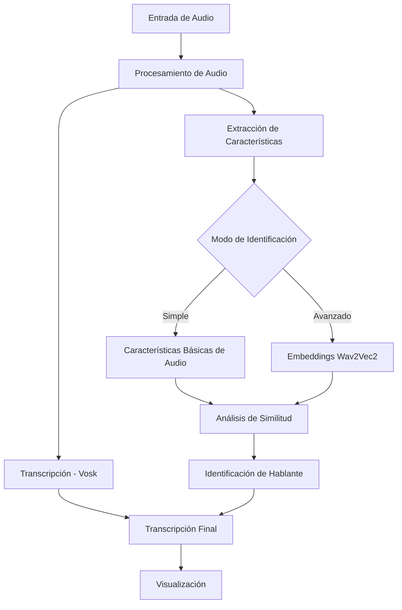

# Hispano Transcriber


**Hispano Transcriber** es un sistema avanzado de transcripción de voz en español con identificación automática de hablantes. Esta herramienta permite realizar transcripciones precisas en tiempo real del español hablado y distinguir automáticamente entre diferentes participantes en una conversación.

Ideal para transcripción de:
- Entrevistas
- Reuniones y conferencias
- Clases y presentaciones
- Podcasts y material multimedia
- Investigación cualitativa

## Índice
- [Características](#características)
- [Arquitectura](#arquitectura)
- [Requisitos](#requisitos)
- [Instalación](#instalación)
- [Uso](#uso)
- [Configuración Avanzada](#configuración-avanzada)
- [Modelo de Voz](#modelo-de-voz)
- [Estructura del Proyecto](#estructura-del-proyecto)
- [Desarrollo](#desarrollo)
- [Referencias](#referencias)
- [Contribuciones](#contribuciones)
- [Licencia](#licencia)
- [Contacto](#contacto)

## Características

| Característica | Descripción | Disponible |
|----------------|-------------|------------|
| **Transcripción en tiempo real** | Procesamiento del audio y visualización de la transcripción a medida que se habla | ✓ |
| **Reconocimiento de español** | Optimizado para el idioma español con soporte para diversos acentos | ✓ |
| **Identificación de hablantes** | Diferencia automáticamente entre múltiples participantes en una conversación | ✓ |
| **Visualización por colores** | Representación visual de cada hablante con diferenciación por colores | ✓ |
| **Modo simple/avanzado** | Opción de usar características básicas o embeddings avanzados para identificación | ✓ |
| **Interfaz CLI intuitiva** | Comandos simples y opciones de configuración por línea de comandos | ✓ |
| **Ajuste de umbral de similitud** | Personalización de la sensibilidad en la detección de cambio de hablante | ✓ |

## Arquitectura

La arquitectura de Hispano Transcriber está diseñada para maximizar la precisión en la transcripción y la identificación de hablantes mediante un enfoque modular y extensible:



### Componentes Principales:

1. **Captura de Audio**: Utiliza SoundDevice para capturar audio en tiempo real del micrófono.
2. **Motor de Transcripción**: Basado en Vosk, optimizado para español.
3. **Sistema de Identificación de Hablantes**:
   - **Modo Simple**: Extrae características acústicas básicas (energía, tasa de cruce por cero, centroide espectral).
   - **Modo Avanzado**: Utiliza embeddings del modelo Wav2Vec2 para una representación más sofisticada de las voces.
4. **Gestor de Hablantes**: Mantiene un registro de los perfiles de hablantes y determina cuando hay cambios de locutor.

## Requisitos

### Software:
* **Python 3.8+**
* **Sistema Operativo**: Windows, macOS o Linux

### Hardware recomendado:
* **Procesador**: Dual-core 2GHz o superior
* **RAM**: 4GB mínimo (8GB recomendado para el modo avanzado con Wav2Vec2)
* **Espacio en disco**: 500MB para el software y modelos
* **Micrófono**: De calidad media o superior para mejores resultados

### Dependencias principales:
* `sounddevice`: Captura de audio
* `vosk`: Motor de reconocimiento de voz
* `numpy`: Procesamiento numérico
* `transformers`: Para modelos de identificación avanzados (Wav2Vec2)
* `torch`: Backend para los modelos de aprendizaje profundo
* `scikit-learn`: Análisis de similitud y clustering

## Instalación

Existen varias formas de instalar Hispano Transcriber:

### Instalación estándar

1. **Clonar el repositorio:**

   ```bash
   git clone https://github.com/HispanoTech-UGC/hispano-transcriber.git
   cd hispano-transcriber
   ```

2. **Instalar dependencias:**

   ```bash
   pip install -r requirements.txt
   ```

3. **Descargar el modelo de voz:**

   ```bash
   python scripts/download_model.py
   ```
   
   El script descargará automáticamente el modelo de Vosk para español (~50MB) y lo configurará.

### Instalación como paquete (desarrollo)

Para instalar el paquete en modo desarrollo:

```bash
pip install -e .
```

Esto permitirá importar `hispano_transcriber` como un módulo de Python.

### Instalación en entorno virtual

Recomendado para aislar las dependencias:

```bash
# Crear entorno virtual
python -m venv venv

# Activar el entorno (Windows)
venv\Scripts\activate

# Activar el entorno (macOS/Linux)
source venv/bin/activate

# Instalar dependencias
pip install -r requirements.txt
```

## Uso

### Modos de operación

#### Transcripción simple:

Para transcribir sin identificación de hablantes:

```bash
python -m hispano_transcriber.transcriber
```

#### Con identificación de hablantes:

```bash
python -m hispano_transcriber.transcriber_speaker
```

#### Opciones de configuración:

| Opción | Descripción | Valor predeterminado |
|--------|-------------|----------------------|
| `--umbral` | Umbral de similitud para la detección de hablantes (0-1) | 0.85 |
| `--simple` | Usar características simples en vez de Wav2Vec2 | False |

Ejemplo con parámetros personalizados:

```bash
python -m hispano_transcriber.transcriber_speaker --umbral 0.75 --simple
```

### Uso programático

También puedes usar Hispano Transcriber como una biblioteca en tus proyectos:

```python
from hispano_transcriber import transcriber_speaker

# Inicializar el transcriptor con un umbral personalizado
transcriber = transcriber_speaker.SpeakerManager(similarity_threshold=0.8)

# Cargar modelos
model, recognizer = transcriber_speaker.cargar_modelos()

# Usar en tu aplicación
# ...
```

## Configuración Avanzada

### Personalización del reconocimiento

El archivo `config.py` (no incluido en la versión actual) permitirá en futuras versiones configurar:

* **Parámetros de audio**: Frecuencia de muestreo, tamaño de bloque
* **Umbrales de detección**: Sensibilidad para detectar cambios de hablante
* **Características de extracción**: Selección de características específicas para la identificación
* **Persistencia de perfiles**: Guardar y cargar perfiles de hablantes

### Configuración de visualización

Personalización del formato de salida en la consola:

```python
# Ejemplo para modificar los colores de los hablantes
def personalizar_visualizacion():
    colors = {
        "Hablante 1": "\033[94m",  # Azul
        "Hablante 2": "\033[91m",  # Rojo
        "Hablante 3": "\033[92m",  # Verde
        # ...
    }
    return colors
```

## Modelo de Voz

Hispano Transcriber utiliza el modelo Vosk para español, optimizado para el reconocimiento de habla hispana.

### Características del modelo:

* **Idioma**: Español (todos los dialectos)
* **Tamaño del vocabulario**: >60,000 palabras
* **Tecnología**: Basado en Kaldi, redes neuronales y modelos acústicos
* **Soporte offline**: No requiere conexión a internet
* **Tamaño del modelo**: ~50MB

### Alternativas de modelos:

Para diferentes necesidades, se pueden utilizar modelos alternativos:

| Modelo | Tamaño | Precisión | Velocidad | Uso recomendado |
|--------|--------|-----------|-----------|-----------------|
| vosk-model-es-0.42 | 50MB | Alta | Rápido | **Uso general** (predeterminado) |
| vosk-model-small-es-0.42 | 15MB | Media | Muy rápido | Dispositivos con recursos limitados |
| vosk-model-es-0.42-lgraph | 1.2GB | Muy alta | Moderado | Transcripciones de alta precisión |

## Estructura del Proyecto

```
hispano_transcriber/
├── docs/                      # Documentación
│   └── usage.md               # Guía de uso detallada
├── examples/                  # Ejemplos de uso
│   └── example_usage.py       # Ejemplo básico de uso
├── scripts/                   # Scripts útiles
│   └── download_model.py      # Script para descargar el modelo Vosk
├── src/                       # Código fuente
│   ├── hispano_transcriber/   # Paquete principal
│   │   ├── __init__.py        # Inicializador del paquete
│   │   ├── __main__.py        # Punto de entrada
│   │   ├── transcriber.py     # Transcriptor simple
│   │   └── transcriber_speaker.py # Transcriptor con identificación
│   └── __init__.py            # Inicializador del directorio src
├── tests/                     # Tests unitarios
│   ├── __init__.py            # Inicializador de tests
│   └── test_speaker_manager.py # Tests para el gestor de hablantes
├── vosk-model-es-0.42/        # Modelo de voz (se descarga por separado)
├── .gitignore                 # Archivos ignorados por git
├── CHANGELOG.md               # Historial de cambios
├── CONTRIBUTING.md            # Guía de contribución
├── LICENSE                    # Licencia MIT
├── README.md                  # Este archivo
├── requirements-dev.txt       # Dependencias para desarrollo
├── requirements.txt           # Dependencias principales
└── setup.py                   # Configuración de instalación
```

## Desarrollo

### Configuración del entorno de desarrollo

Para configurar un entorno de desarrollo:

1. Instalar dependencias de desarrollo:
   ```bash
   pip install -r requirements-dev.txt
   ```

2. Configurar herramientas de calidad de código:
   ```bash
   pre-commit install  # Será implementado en futuras versiones
   ```

### Flujo de trabajo de desarrollo

```
1. Crear rama de característica
2. Desarrollar y probar localmente
3. Ejecutar tests unitarios
4. Asegurar cobertura de código
5. Crear pull request
```

### Ejecución de tests

```bash
# Ejecutar todos los tests
pytest

# Con cobertura de código
pytest --cov=hispano_transcriber

# Tests específicos
pytest tests/test_speaker_manager.py
```

### Diagnósticos y depuración

El módulo incluye información de diagnóstico que puede activarse:

```python
import logging
logging.basicConfig(level=logging.DEBUG)
```

Puntos comunes de depuración:

| Problema | Solución |
|----------|----------|
| No se detecta micrófono | Verificar permisos y dispositivos |
| Error al cargar modelo | Ejecutar `scripts/download_model.py` |
| Mala detección de hablantes | Ajustar `--umbral` (0.7-0.9) |
| Alto uso de CPU/memoria | Usar `--simple` para identificación básica |

## Referencias

### Tecnologías utilizadas

* **[Vosk](https://alphacephei.com/vosk/)**: Motor de reconocimiento de voz offline
* **[Wav2Vec2](https://huggingface.co/facebook/wav2vec2-base)**: Modelo de incrustaciones de voz
* **[SoundDevice](https://python-sounddevice.readthedocs.io/)**: Manejo de audio en tiempo real
* **[NumPy](https://numpy.org/)**: Procesamiento numérico eficiente
* **[Scikit-Learn](https://scikit-learn.org/)**: Algoritmos de clustering y similitud

### Publicaciones relevantes

* Baevski, A., et al. (2020). "wav2vec 2.0: A Framework for Self-Supervised Learning of Speech Representations."
* Povey, D., et al. (2011). "The Kaldi Speech Recognition Toolkit."
* Ryant, N., et al. (2019). "Speaker Diarization: From the Lab to the Wild."

### Comparativa con otras herramientas

| Herramienta | Offline | Español | Identificación de hablantes | Código abierto |
|-------------|---------|---------|----------------------------|---------------|
| **Hispano Transcriber** | Sí | Sí | Avanzada | Sí |
| Google Speech-to-Text | No | Sí | Limitada | No |
| Mozilla DeepSpeech | Sí | Parcial | No | Sí |
| CMU Sphinx | Sí | Parcial | No | Sí |
| Whisper | Sí | Sí | No | Sí |

## Contribuciones

El proyecto Hispano Transcriber está abierto a contribuciones de la comunidad. Por favor, consulta [CONTRIBUTING.md](CONTRIBUTING.md) para más detalles sobre el proceso.

### Áreas de mejora

- [ ] Mejoras en la precisión de identificación de hablantes
- [ ] Optimización para dispositivos de bajo rendimiento
- [ ] Interfaz gráfica de usuario (GUI)
- [ ] Soporte para regionalización y dialectos
- [ ] Exportación de transcripciones en diferentes formatos

### Colaboradores

* [Sento Marcos](https://github.com/SentoMarcos) - Desarrollador principal
* Proyecto parte de [HispanoTech-UGC](https://github.com/HispanoTech-UGC)

## Licencia

Este proyecto está licenciado bajo la [Licencia MIT](LICENSE) - vea el archivo LICENSE.md para más detalles.

```
MIT License

Copyright (c) 2025 Sento Marcos

Permission is hereby granted, free of charge, to any person obtaining a copy
of this software and associated documentation files (the "Software"), to deal
in the Software without restriction...
```

## Contacto

* **Desarrollador principal**: [Sento Marcos](https://github.com/SentoMarcos)
* **Organización**: [HispanoTech-UGC](https://github.com/HispanoTech-UGC)
* **Sitio web del proyecto**: [https://github.com/HispanoTech-UGC/hispano-transcriber](https://github.com/HispanoTech-UGC/hispano-transcriber)
* **Reporte de problemas**: [Página de issues](https://github.com/HispanoTech-UGC/hispano-transcriber/issues)

---

Desarrollado con **Python** | Proyecto de Robótica UPV-GTI 3-B | 2025
